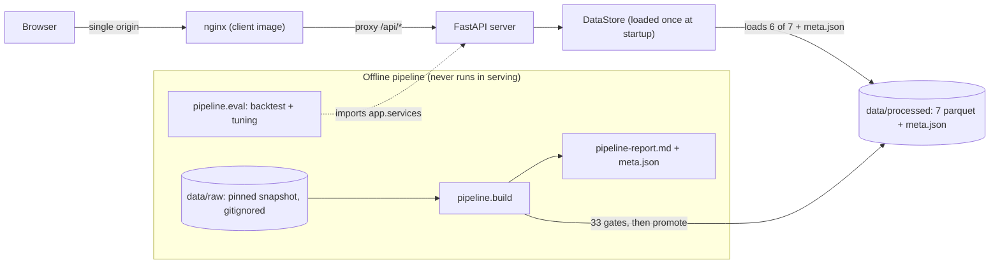
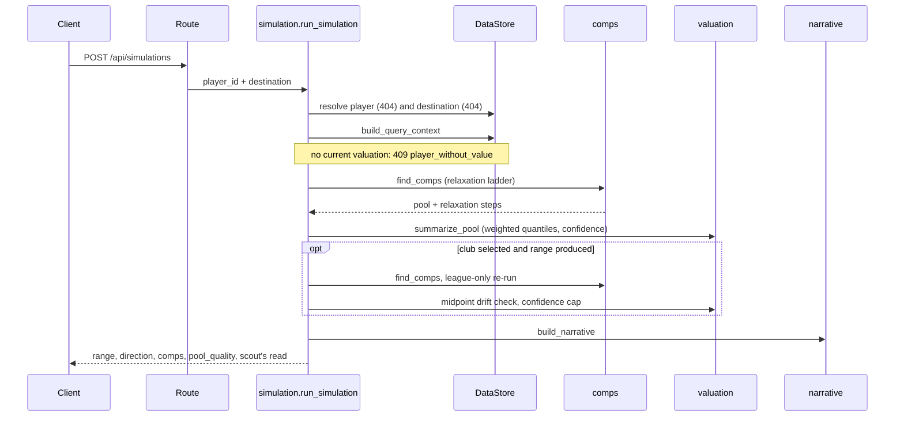

# Architecture

Precedent is three deliverables in one repo: a FastAPI server that answers valuation
queries, a React client that renders them, and an offline pipeline that turns raw football
data into the artifacts the server reads. The contract between them is deliberately narrow:
**the server reads `server/data/processed/*.parquet` plus `meta.json`, and nothing else** —
no databases, no external services, no network calls at runtime.

Reading order for the other layers: the build is documented in [pipeline.md](pipeline.md),
the prediction engine in [methodology.md](methodology.md), the HTTP surface in
[api.md](api.md), and the client in [frontend.md](frontend.md).

## The system at a glance

The two lanes never overlap in time: the pipeline runs offline (and may need network access
to acquire raw data); the served app starts from committed artifacts and stays offline.

## The serving boundary

The import rule is one-directional and absolute: **`app/` never imports `pipeline/`.**
Anything both sides must agree on (for example `season_min`, the first season in the comps
universe) is written into `meta.json` by the build and read from there by the server —
shared *data*, not shared *code*. This keeps the server deployable from artifacts alone and
makes "what exactly does the server depend on?" answerable by listing one directory.

There is one deliberate exception in the other direction: `pipeline/eval/` (the temporal
backtest and tuning harness) imports `app.services`, because its whole point is to evaluate
the *shipped* engine — a reimplementation would validate the reimplementation, not the
product. The dependency is still one-way in effect: tuning never writes into `app/`; a
winning configuration is frozen into `app/services/constants.py` by hand in a reviewed
commit (see [pipeline.md](pipeline.md#the-eval-harness)).

## Server layout

Four layers, each with one job:

- `app/api/routes/` — thin handlers: parse the request, call one service, return its result.
  No logic, no data access. Four routers (health, players, destinations, simulations) mount
  under `/api`.
- `app/services/` — all domain logic: `comps.py` (matching + relaxation), `valuation.py`
  (range + confidence), `narrative.py` (deterministic templates), `percentiles.py`, and the
  read services/orchestrator (`players.py`, `destinations.py`, `simulation.py`).
  `constants.py` holds every tunable, with backtest provenance in its docstring.
- `app/repositories/` — the only code that touches data files. `load_store` reads six of
  the seven artifacts plus `meta.json` into a `DataStore` of typed repos;
  `elo_mapping.parquet` is a build diagnostic and is never loaded. The transitions repo
  drops `suspected_loan` rows once at load, so no downstream code can forget the filter.
- `app/schemas/` — Pydantic request/response models, the API's public shape.

Everything loads once, at startup, via the lifespan — a request never opens a file.

## A simulation, end to end

The orchestrator (`app/services/simulation.py`) owns this sequence and nothing else; what
each step *means* — the ladder, the quantile math, the club-indistinct re-check — is
specified in [methodology.md](methodology.md).

## Cross-cutting plumbing

**Settings.** Exactly two, prefixed `PRECEDENT_`: `PRECEDENT_PORT` and
`PRECEDENT_DATA_DIR`. Everything else is either a build-time constant or a tuned value in
`constants.py`. No setting can change what the engine computes.

**Clock.** Time enters through an injectable `Clock` protocol (`app/core/clock.py`) read
from `app.state.clock`. Production uses the real system date on purpose: the dataset has a
freshness cut-off, and pinning "today" to that cut-off would make stale data look current.
Instead, staleness is *surfaced* — valuations carry as-of dates and the narrative warns when
a baseline valuation is over a year old. Tests inject `FixedClock` for determinism.

**Errors.** One envelope for every failure: `{"error": {code, message, detail}}`. The codes
are `player_not_found` (404), `destination_not_found` (404), `player_without_value` (409),
`validation_error` (422), `http_error`, and `internal_error` (500, deliberately generic).
The 409 exists because a simulation without a current value has no baseline to multiply —
the guard is a domain answer, and it must stay a 409 rather than surfacing later as a
`math.log` domain error. Full catalog with captured examples: [api.md](api.md#errors).

**Two name normalizers, on purpose.** API search folding (`app/core/text.py`) and the
pipeline's club-name matcher (`pipeline/naming.py`) look similar and must not be merged.
The club matcher strips stop tokens ("fc", "de", …) that are meaningful in player names,
and uses German-style transliteration (ö → "oe") because that is how ClubElo spells club
names. Search input works the other way: people type "ozil", not "oezil", so the search
fold maps umlauts and ø to the bare letter rather than the German-style digraph.

## The client, in brief

The client treats the API as an immutable snapshot: `POST /api/simulations` is modeled as a
TanStack Query *query*, not a mutation — it is a deterministic, side-effect-free read — with
`staleTime: Infinity` because the dataset only changes when the server image is rebuilt
("page refresh is the cache bust"). 4xx responses are never retried; they will not heal.
The URL is the single source of destination truth (`?league=`, `?club=`), which makes every
verdict shareable and drives the compare tray. There is no global state library. Full
treatment: [frontend.md](frontend.md).

## Test-injection seams

Both sides expose one construction seam and test against synthetic data only:

- Server: `create_app(store=..., clock=...)` — tests build a `DataStore` from small
  synthetic frames and pin a `FixedClock`; production passes neither and the lifespan loads
  the real artifacts.
- Client: `renderWithProviders(ui)` wires a fresh QueryClient (retries off), motion config,
  compare context and a `MemoryRouter`; fixtures are hand-authored literals with a stubbed
  `fetch`.

No test anywhere reads the processed datasets — real data is a product concern, synthetic
data is a test concern, and the two never mix.

## Deployment

`docker compose up` starts two services:

- **server** — Python image with the processed artifacts baked in at build time; serves
  `/api` on its internal port. Its healthcheck calls `/api/health`, which only answers once
  the DataStore is loaded — real readiness, not process-up.
- **client** — nginx serving the built SPA and proxying `/api/*` to the server container,
  so the browser sees a single origin and CORS never enters the picture. Hashed assets are
  cached forever; `index.html` always revalidates; unknown paths fall back to the SPA shell
  for client-side routes.

Both healthchecks explicitly bypass any ambient HTTP proxy (corporate proxies would
otherwise intercept loopback probes). The served stack makes no network calls: data
acquisition is an offline pipeline concern.
