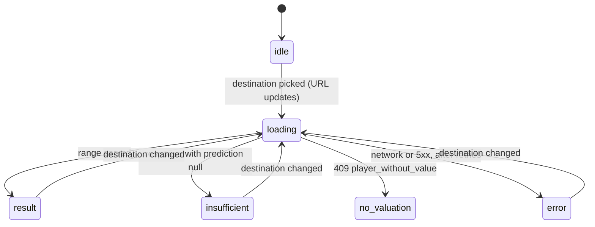

# Frontend guide

Vite + React 19 + TypeScript (strict), Tailwind v4 (CSS-first, tokens in
`src/index.css`), TanStack Query for server state, Recharts for the value chart, React
Router, `motion` for animation. Tests: Vitest + React Testing Library. What the fields
*mean* is server territory ([api.md](api.md), [methodology.md](methodology.md)); this doc
covers how the client consumes and presents them.

## Routes

Three screens under one `PageLayout` (`src/main.tsx`):

- `/search` (also `/`) — hero search; the query lives in `?q=` so results survive Back and
  the URL is shareable (synced with `replace`, not `push`, once the input debounce
  settles).
- `/players/:id` — profile: value chart with the player's own transfers annotated, value
  fact chips, percentiles vs peers.
- `/players/:id/simulate` — the transition simulator.

## Server state: POST-as-query

`POST /api/simulations` is a deterministic, side-effect-free read, so it is modeled as a
TanStack **query**, keyed `['simulations', playerId, leagueId, clubId]` — not a mutation
(`src/lib/queries.ts`). Revisiting a destination serves the cached verdict instantly; with
no destination selected the key collapses to `['simulations', playerId, 'idle']` and the
query is disabled.

Two global defaults (`src/main.tsx`) encode the data model:

- `staleTime: Infinity` — the dataset is static per server build; a page refresh is the
  cache bust.
- retries: at most 2, and **never for 4xx** — client errors (404 unknown player, 409 no
  valuation) will not heal on retry.

## The URL is the source of destination truth

On the simulate page, `?league=` and `?club=` *are* the state (`club` validated against
`/^\d+$/`); picking a destination writes the URL, and everything — the query key, the
verdict panel, the compare tray — derives from it. Consequences: every verdict is
shareable, Back/Forward walk the comparison history, and a pinned compare card can link
back to the exact URL that produced it.

## The simulator state machine

`src/lib/simulatorState.ts` collapses destination selection + query status into one
discriminated union, *derived* on every render (no stored state to drift):

The one ordering subtlety is documented in the module: **a disabled query still reports
`isPending: true`, so the idle check must run before the loading check** — otherwise the
simulator would render a spinner forever while waiting for a destination that hasn't been
chosen. `insufficient` is not an error state: it carries the full response (pool quality,
closest evidence, narrative) and renders as a first-class verdict.

## Compare: pins and the tray

Pinned verdicts live in **sessionStorage** (`src/lib/compare.tsx`), deliberately not
localStorage: pins must survive navigation — pin A, browse to B, compare is the whole point
— but not a new session, because a comparison held across a data refresh would be quietly
wrong. At most **2 pins** (comparing is a pairwise act); pinning a third replaces the
older. Each card stores the simulate URL that produced it, so a pin is always one click
from its evidence.

## The honesty register

UI rules that encode the product principles — each lives in exactly one component/module:

| Rule | Where |
|---|---|
| The direction arrow renders the **served** `direction` field, never a client-side recomputation — the same server function feeds the narrative, so arrow and words cannot disagree, even across a retune | `VerdictPanel` |
| Decliners render at identical prominence to risers — same type size, same layout; red is a color, not a demotion | `CompCardView` |
| CountUp always settles on exactly `format(value)`, never a lerped float; reduced motion renders the final value synchronously | `motion/CountUp` |
| The range band clamps outlier comp dots to its edge and says so — "(N beyond this scale, pinned to the edge)" — instead of letting a 4× outlier crush the band, or a pile-up at the edge read as data at the edge | `lib/rangeBand` + `RangeBand` |
| Relaxation steps are humanized by pattern (numbers captured, not hardcoded, so a retuned ladder still reads well); an unrecognized step passes through **verbatim** — a widening is never dropped — and the server's exact wording is kept in the element's `title` as a traceability breadcrumb | `lib/relaxation` + `PoolQualityBanner` |
| Club-level caveats are cause-first: `club_standing_support === 0` (the club term extrapolated) wins over `club_indistinct` in the banner; thin Elo coverage in the pool (< 0.5) gets its own note | `PoolQualityBanner` |
| Percentiles arrive display-oriented ("better than X% of peers") and are **never re-inverted**; lower-is-better metrics get a sublabel, not a flipped bar; the legend ("82nd = better than 82% of those peers · mid line = peer median") is visible, not a tooltip | `PercentileBars` |
| Weak-evidence confidence tiers never wear a verified-looking seal: caution tiers get an alert ring, not the check seal, and "high" copy reads as *strong precedent agreement — not a guarantee* (the backtest's high-tier under-coverage is a documented finding) | `VerdictPanel` + `confidenceCopy` |

## Design system

Tokens live in `src/index.css` (Tailwind v4 `@theme`; there is no `tailwind.config`).

- **Three anchors**: `#010103` (pitch, base background) · `#24496d` (yale, primary) ·
  `#f9ac91` (tangerine, accent). All other steps are OKLCH-interpolated through the
  anchors so every ramp stays monotonic in lightness.
- **The role rule**: tangerine is **brand/interaction only** (CTAs, links, focus, logo);
  rise/decline/caution are **data semantics only** (deltas, confidence, caveats). The two
  vocabularies never compete in the same role, and caution sits at an amber-yellow hue
  (~98) specifically so it cannot be misread as the peach accent under deutan/protan
  vision. Contrast is verified in the token file (AA ≥ 4.5:1 for text, ≥ 3:1 focus rings,
  OKLab distance ≥ 9 under CVD simulation); color is never the only signal.
- **Badge vs Chip**: Badges are the *identity* family — squared, hairline-bordered, for
  who/where facts (positions, leagues, tiers). Chips are the *state* family — round,
  filled, for verdicts and conditions. The shape split is deliberate so the two never read
  as one another.
- **Type**: Fraunces (display) / Inter (text), both self-hosted variable fonts — no font
  CDN, so Docker builds render identically offline.
- **Motion**: conveys state, never decoration — enter-only, 150–300 ms, expo-out; **bad
  news is never delayed for choreography**; `prefers-reduced-motion` is honored globally
  (`MotionConfig reducedMotion="user"`).
- **Glass and depth**: every glass panel is its own stacking context (backdrop-filter), so
  the z-scale is semantic and small: in-panel dropdowns `z-10` → panels that spawn
  overlays `z-30` → sticky header `z-40` → film-grain overlay `z-50`.
- **The logo** is the product thesis drawn: a value leaves the baseline on a rising arc
  and lands higher — the comp card's before→after slope made iconic.

## Formatters and the lib map

`src/lib/format.ts`: every formatter maps null/undefined to an em dash; signs use the real
minus sign (U+2212), not a hyphen. Ranges compress shared units ("€38–46M", but
"€850k–€1.2M" across units; equal ends collapse). Dates are parsed by hand because
`new Date(iso)` reads date-only strings as UTC and shows the previous day in
negative-offset timezones. `horizonMonthYear` turns as-of + 12 months into a concrete
"Jun 2027" — a date a reader can hold, not an abstract horizon.

One-liner map of `src/lib/`:

| Module | Job |
|---|---|
| `api.ts` | fetch wrapper; `ApiError` preserves the server's error envelope, network failures become status 0 |
| `queries.ts` | query hooks + key factory (POST-as-query lives here) |
| `types.ts` | TypeScript mirrors of the server's Pydantic models |
| `simulatorState.ts` | the six-state derivation (pure) |
| `format.ts` | euro/percent/date/range formatters |
| `rangeBand.ts` | pure band geometry: padded domain that always contains "now", outlier clamping |
| `trend.ts` | the one place a delta's sign becomes a semantic trend |
| `relaxation.ts` | ladder-step humanizer, verbatim fallback |
| `labels.ts` | position/tier/club-budget display names |
| `valueFacts.ts` | peak, since-peak, 12-month delta from served history (mirrors the server's search-trend definition) |
| `suggestions.ts` | the three one-click idle-state destination picks (ambition / sideways / contrast) |
| `comparePins.ts` / `compare.tsx` | pure pin state + sessionStorage provider |
| `motion.ts` | easing, page-enter, reduced-motion hook |

## Testing

`src/test/utils.tsx` exports `renderWithProviders`: a fresh QueryClient per test (retries
off so error states surface immediately), `MotionConfig` + `LazyMotion` (m.* components
need them in tests too), `CompareProvider`, and a `MemoryRouter` with configurable
`initialEntries`. `src/test/setup.ts` stubs `matchMedia` (the motion library requires it)
and runs explicit `cleanup()`. Fixtures are **synthetic inline literals with a stubbed
`fetch`** — no test anywhere touches real data.

From the repo root, `npm run lint` / `typecheck` / `test` each run the client and the
server side back-to-back (eslint + ruff, `tsc -b` + mypy, vitest + pytest).
