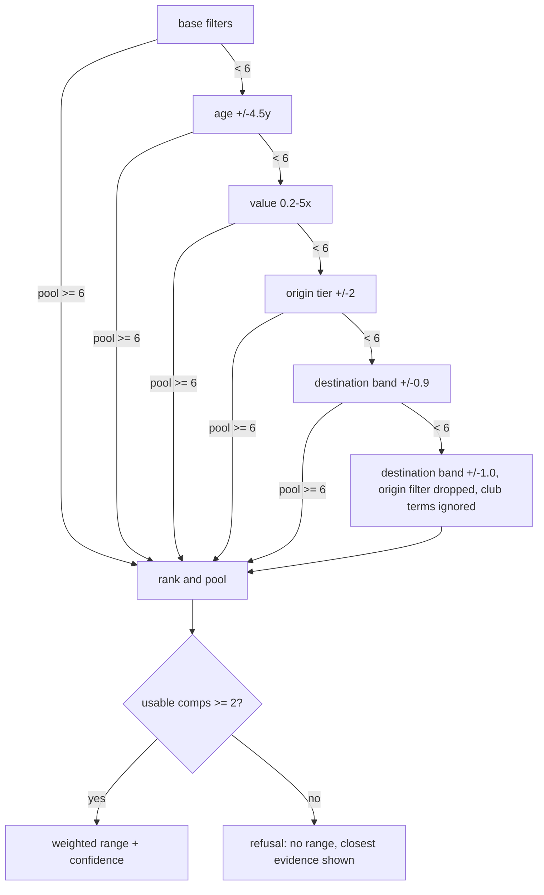
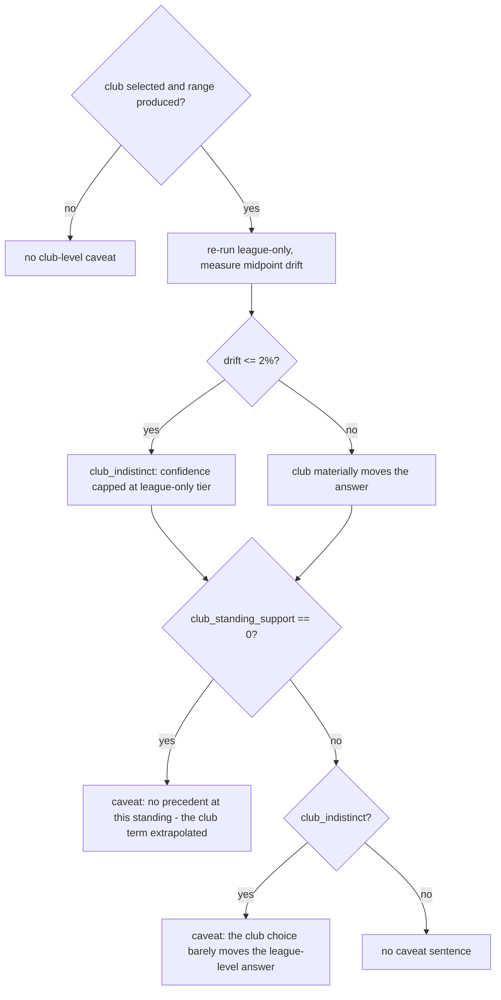

# Methodology — how a prediction is made

The comps engine end to end: what "similar" means, how a pool of named precedents becomes a
value range, and where the honesty mechanisms live. The README carries the compressed
version; this is the full detail. Core terms (transition, v_before, v_after, multiplier,
comp) are defined once in the README's key-definitions block.

Everything here describes the *shipped* configuration in `server/app/services/constants.py`
— every number is either a hand-set constant defended below or a tuned value whose
provenance is in that file's docstring and in [eval-report.md](eval-report.md).

## Query context and the null policy

From the queried player and chosen destination, the engine derives: fractional age today,
origin league tier and strength, origin club's within-league squad-value percentile
(`club_value_pct`), the player's minutes share over the last 365 days, and the destination
league's strength (plus, when a club is chosen, that club's `club_value_pct` and Elo
percentile).

Any of these can be unknown, and the policy is uniform — **nulls never gate and never
penalize**:

- A null on the *query* side skips the affected filter or ranking term entirely, and says
  so in `pool_quality` (`missing_age`, `missing_minutes`, `origin_tier_unknown`).
- A null on the *comp* side fails an active hard filter naturally (you cannot pass an age
  filter without an age), and drops ranking terms per-comp with weight renormalization
  (below), so a data gap never masquerades as distance.

## Hard filters

A transition must pass all active filters to be a candidate:

| Filter | Base value |
|---|---|
| Position group | equal to the player's (always, never relaxed) |
| Season | ≥ 2012/13 (`season_min` from `meta.json`; always) |
| Destination strength band | comp's `to_strength` within ±0.5 of the destination league's strength (ln units, so ±0.5 ≈ a 1.6× median-squad-value band) |
| Age | within ±4.0 years, if the query age is known |
| Value bracket | `v_before` within 0.5–3× the player's current value |
| Origin tier | comp's `from_tier` within ±1 of the player's, if known |

Loans are excluded before any of this (dropped once at data load). A comp with a null
`to_strength` is never eligible — the destination filter is the one filter that never
switches off — and a destination league with no strength on record yields an empty pool
immediately rather than an unanchored search.

## The relaxation ladder

When fewer than 6 candidates (`MIN_POOL_TARGET`) survive, the search widens one step at a
time and stops at the first step that reaches 6. The steps, with their exact labels as
served in `pool_quality.relaxation_steps`:

1. `base filters`
2. `age band widened to +/-4.5 years`
3. `value bracket widened to 0.2-5x`
4. `origin league tier widened to +/-2`
5. `destination league band widened to +/-0.9 (~2.5x squad value)`
6. `destination league band widened to +/-1 (~2.7x squad value); origin league filter dropped; club-level terms ignored`

Two asymmetries are deliberate:

- **The destination band widens last and is never dropped.** The question being answered is
  "what happens on a move *to this destination*" — an engine that quietly answers a
  different destination's question has stopped being useful. Even at the final step, the
  band is ±1.0 ln units, not infinity.
- **The origin side is a control, not the question.** Origin tier widens early and is
  dropped entirely at the last step: where a player comes from matters for similarity but
  is not what the user asked about.

Every widening is surfaced: `pool_quality` carries the relaxation level and the exact step
labels, the client renders them, and the narrative appends an "expanded search" sentence.
A widened search is never presented as a base-filter one.

## Ranking

Survivors are ranked by weighted distance. The ten terms, in the order the engine computes
them, with the tuned weights (values rounded to 3 decimals; full precision in
`constants.py`):

| # | Term | Distance | Scale | Weight |
|---|---|---|---|---|
| 1 | Market value | abs difference of ln v_before | ln 2.5 | 0.211 |
| 2 | Age | abs difference in years | 3.0 | 0.052 |
| 3 | Destination strength | abs ln-strength difference | 1.0 | 0.093 |
| 4 | Origin strength | abs ln-strength difference | 1.0 | 0.172 |
| 5 | Destination club Elo | abs difference of Elo percentiles | — | 1.435 |
| 6 | Destination club standing | abs difference of `club_value_pct` | — | 0.925 |
| 7 | Origin club standing | abs difference of `club_value_pct` | — | 0.181 |
| 8 | Playing time | abs difference of `minutes_share_pre` | — | 0.070 |
| 9 | Sub-position | 0 if equal, 1 if not | — | 0.296 |
| 10 | Recency | seasons since the comp | 13.0 | 0.318 |

Terms 5–7 only apply when a destination club is chosen (and are ignored at ladder step 6);
terms 2, 8, 9 only when the query knows its age / minutes / sub-position. Per comp, any
term missing on either side drops from **both the numerator and the weight mass**, so a
null never penalizes. `similarity = exp(−distance)`; ties break deterministically on
`(distance, player_id, transfer_date)`. The top `POOL_K = 41` comps form the quantile pool;
the API returns all of them, with `shown_comps = 6` as the default UI cut.

**Provenance.** The weights, ladder geometry (including the destination bands),
`MIN_POOL_TARGET` and `POOL_K` come from a random search — 300 sampled configs plus the
hand-set priors as trial 0, seed 20260718 — scored on mean validation pinball (seasons
2020–21) under the date-exact availability rule, with refusals imputed at the naive
baseline's pinball. Winning config hash `7309dc25f471` (validation pinball 0.17000 vs
0.17471 hand-set). The winner was frozen into `constants.py` **by hand in a reviewed
commit** — tuning code never writes into `app/` — and test seasons were scored exactly
once, after the freeze. Details: [eval-report.md](eval-report.md) and
[pipeline.md](pipeline.md#the-eval-harness).

## The range

The prediction is a weighted quantile band of the pool's multipliers, weighted by
similarity — **cumulative-weight midpoint interpolation**: sort the pool, give each point
the midpoint of its weight mass (`c_i = (cum_before_i + w_i/2) / total`), clamp outside
`[c_1, c_n]`, interpolate linearly between neighbours. The estimator is chosen for its
behavior at the edges the product actually visits: it is exact and deterministic at n = 2
(the refusal threshold), monotone in the quantile level, and reduces to plain midpoint
quantiles under equal weights.

The served band is the pool's q25–q75 (multiplied through the player's current value), with
q50 as the midpoint. Calibration machinery exists — endpoints are computed at
`max(0.05, 0.25 − shift)` / `min(0.95, 0.75 + shift)` per confidence tier — but every shift
is 0.0: on validation the pooled coverage came in at 51.6%, inside the 45–55% trigger band,
so **no calibration was applied, by evidence rather than by assumption**. Dispersion (and
therefore confidence) is always judged at the nominal 25/75 levels, so calibration could
never move a pool between confidence tiers.

## Confidence, direction, refusal

| Tier | Requires |
|---|---|
| high | pool ≥ 12 **and** IQR of log multipliers ≤ 0.35 (≈ q75/q25 ratio 1.42) **and** no relaxation |
| medium | pool ≥ 6 **and** IQR ≤ 0.60 (≈ ratio 1.82) **and** relaxation ≤ 2 |
| low | anything else with ≥ 2 comps |
| insufficient | fewer than 2 usable comps — **no range at all**, closest evidence shown instead |

The thresholds are hand-set, and the reason is documented rather than hidden: at freeze
time, an honesty grid over 324 threshold settings found **zero** settings whose high tier
actually covered its nominal band on validation, so no grid setting could honestly be
adopted. On post-repair validation records, 72 of 324 settings now pass that screen — but
the shipped thresholds were frozen before the test seasons were scored, and re-picking them
after later data repairs would be post-hoc tuning. The cost is stated everywhere it
matters: the high tier under-covers (45.5% on validation, 41.5% on test), so the product
presents "high" as *strong precedent agreement, not a guarantee* — in the UI copy, and in
[the README's limitations](../README.md#limitations--what-would-need-to-change-to-trust-this-with-real-money).

**Direction** is served, not inferred client-side: rise if q50 ≥ 1.05, decline if ≤ 0.95,
flat between. One function (`direction_of`) feeds both the narrative's wording and the
API's `direction` field, so the arrow and the words can never disagree.

## Club-level honesty

Choosing a destination *club* re-weights the same evidence (terms 5–6 above); it does not
conjure club-specific precedent. Two mechanisms keep that honest, and the caveat states the
*cause*, not just the symptom:

- **The indistinct check.** With a club selected and a range produced, the engine re-runs
  the search league-only and measures midpoint drift `|q50_club / q50_league − 1|`. Drift
  ≤ 2% ⇒ `pool_quality.club_indistinct = true` and the stated confidence is capped at the
  league-only tier — re-weighting the same evidence must never *raise* confidence above
  what the league-only search earns. The test is midpoint drift **only**, deliberately
  ignoring pool identity: with more candidates than `POOL_K`, club terms reshuffle which
  comps make the cap even when the answer is unmoved, so "different comps" is not evidence
  of a different answer.
- **Standing support.** `pool_quality.club_standing_support` counts pool comps whose
  destination-club standing is within ±0.15 of the chosen club's. **0 means the club term
  extrapolated** — there is no precedent *at this standing*, and the caveat says so ahead
  of any indistinct wording (the deeper cause wins). `null` means no club (or no
  percentile) was in play at all. The evidence behind the extrapolation case: no €60M+ move
  in the dataset went to a bottom-third budget club (see the evidence section below).

## League strength & tiers

Two related but different constructs:

- **Strength** — `ln(median derived squad value)` per league-season, continuous. This is
  what the engine filters and ranks on (the destination band, the strength distance
  terms). Squad values are derived from player valuations, not the unreliable upstream
  club field ([pipeline.md](pipeline.md#stage-walkthrough)).
- **Tier** — a 1–4 display bucket from fixed strength thresholds (18.4 / 17.0 / 16.3,
  anchored in observed natural gaps at roughly €98M / €24M / €12M median squad value) with
  two-season hysteresis so a knife-edge league does not flap. Tiers survive in the engine
  only as the *origin* control filter; the destination side is continuous. Club terciles
  are display copy only.

## The narrative

The scout's read is assembled from deterministic templates — **no LLM anywhere** — so
identical inputs produce identical words, and every sentence is traceable to a field the
API also serves. Assembly order:

1. Refusal case: the "insufficient precedent … no responsible value range" sentence, plus
   the closest available evidence if any.
2. Otherwise: verdict sentence (from the shared `direction_of`), then the range sentence
   (pool size, typical landing, middle-half band, euro range, confidence).
3. "Closest precedents:" — the top 3 by similarity, named, with season and outcome.
4. Decliner caveat when ≥ 20% of the pool lost value: said in numbers, out loud.
5. Thin-evidence caveat when the pool is ≤ 5.
6. Club-level honesty, cause first (see the decision flow above).
7. Expanded-search sentence carrying the last ladder step's label.
8. Elo-fallback note when the destination club has no rating on record.
9. Stale-baseline warning when the player's valuation is more than a year old.

## What the destination actually changes — evidence

Findings from the destination-sensitivity review of the shipped engine (engine v2, the
strength-band destination filter):

- **League differentiation is real.** For a €200M-class forward, the Premier League
  midpoint lands near €206M while the Danish Superliga lands at €112.5M — same player, same
  method, different precedent. For a €20M-class midfielder, the Premier-League-vs-Serie-A
  midpoint spread went from 3.7% under engine v1 (which required tier *equality* and gave
  the big five leagues one shared candidate set) to 11.8% under the continuous strength
  band — with genuinely different comp pools, not one pool re-weighted.
- **Club differentiation is honestly weak, and the product says so.** Across every value
  bracket, the rank correlation between destination-club standing and outcome multiplier is
  ≈ 0.02–0.09 (Elo percentile does somewhat better at 0.13–0.23 and carries the largest
  tuned weight). The data does not support strong club-level claims, so the engine makes
  none: that is exactly what the indistinct flag, the confidence cap and the
  standing-support count surface. A tool that *decorated* club choices with fabricated
  precision would demo better and be worse.
- **The extrapolation floor is real.** Moves into bottom-third budget clubs make up 31.8%
  of sub-€2M transfers, 1.9% of €30–60M transfers, and 0% of €60M+ transfers — when an
  elite player is pointed at a small club, there is *no* precedent at that standing, and
  `club_standing_support = 0` is the honest answer.

## Validation in brief

The engine is evaluated, not asserted: a temporal backtest replays 7,376 held-out
transfers (test seasons 2022–24) through the exact serving code, each simulated at its own
transfer date under a date-exact comp-availability rule; weights were tuned on validation
seasons 2020–21, frozen with provenance, and the test set was scored once. Results —
coverage, interval width, pinball versus naive baselines and the deliberately-unshipped
LightGBM skyline — live in [eval-report.md](eval-report.md); the harness mechanics
(availability rule, refusal imputation, parity gate, freeze workflow) are in
[pipeline.md](pipeline.md#the-eval-harness).
