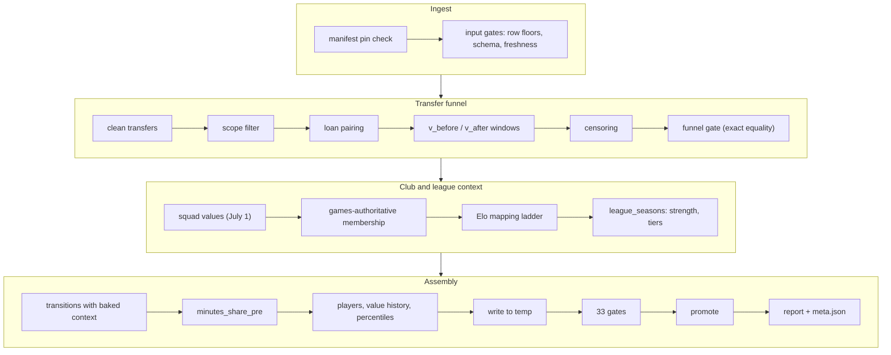

# The data pipeline

How raw football data becomes the seven artifacts in `server/data/processed/`. This doc
covers the build's mechanics and the shape of what it produces; where the raw data comes
from, why it is pinned, and the audit that sized every gate live in
[data-notes.md](data-notes.md). The current build's gate results and funnel counts are in
the generated [pipeline-report.md](pipeline-report.md).

## Running the build

From `server/` (raw data must be present in `server/data/raw/` — acquisition steps in
[data-notes.md](data-notes.md)):

```bash
uv run python -m pipeline.build
```

The build is fully offline and deterministic apart from the `built_at` timestamp. It ends
by promoting artifacts, writing `meta.json`, and regenerating
[pipeline-report.md](pipeline-report.md) — that report is generated output; to change its
prose, edit `pipeline/report.py`, never the file.

## Write to temp, gate, promote

All artifacts are written to a temporary directory first, then a gate table runs, and only
if every gate passes are the files moved into `data/processed/`. A failed build prints the
full gate table, deletes the temp directory, and exits non-zero — **the served artifacts
are never half-updated.**

Two gate families are deliberately *exact-equality*, not floors:

- **The transfer funnel** must reproduce the audited counts exactly. The funnel was sized
  by hand during the initial data audit; if a code change moves any count, the port no
  longer matches the audit and the discrepancy must be re-examined, not absorbed.
- **Valuation freshness** must equal a pinned date. The upstream distribution once shipped
  valuations silently frozen months in the past (issue #377, see
  [data-notes.md](data-notes.md)); an exact-date gate turns that failure mode into a loud
  build break instead of a quietly stale product.

## Stage walkthrough



In execution order:

1. **Manifest pin check.** The raw snapshot's recorded repo/revision must match the pin in
   `pipeline/config.py`; a different snapshot fails before anything is read.
2. **Input gates.** Row-count floors, the players-table schema check, exact-date valuation
   freshness, and a check that every manual Elo fix still resolves to a real club.
3. **Transfer cleaning.** Drop undated transfers, duplicate `(player, date)` rows, and
   self-moves; then keep only transfers where both clubs are inside the covered leagues
   (pseudo-clubs like "Retired"/"Without club" are flagged out by pattern).
4. **Loan detection — structural, because upstream has no loan flag.** A loan parses
   identically to a free transfer (fee 0), so loans are found by shape: an A→B move whose
   fees are zero/unknown followed by the mirror B→A move within 548 days (~18 months) is a
   suspected loan round-trip. Pairing is greedy — candidates sort by `(gap_days, row order)`
   and each leg is consumed at most once — and pairs where any fee is positive are kept as
   buy-backs, not loans. Both legs of a loan pair are flagged; the flag travels into
   `transitions.parquet` rather than deleting rows. Counts and residual risk (loans
   converted to permanent moves never round-trip): [data-notes.md](data-notes.md).
5. **Valuation windows.** `v_before` = last valuation in `[t−180d, t−1d]` — strictly before
   the transfer, so a transfer-day revaluation (which already prices the move) can never
   leak in. `v_after` = first valuation in `[t+180d, t+540d]`. Transfers whose 6-month
   observation point lies beyond the dataset's valuation horizon are marked censored, not
   failed.
6. **Squad values.** A club-season's squad value sums its members' latest valuation as of
   July 1, capped at 365 days of staleness (both edges inclusive). The upstream clubs
   table's own market-value field is unreliable and is not used.
7. **Games-authoritative league membership.** A club belongs to a league-season because it
   *played matches in it*; the upstream current-day snapshot is trusted only for
   league-seasons with no match data at all. Every club-season carries `league_source`
   (`games` / `snapshot` / `none`) so the provenance is queryable. This rule exists because
   snapshot membership shipped phantom members — the story and numbers are in
   [data-notes.md](data-notes.md).
8. **Elo mapping ladder.** ClubElo names are matched to clubs through ordered stages, most
   trusted first: manual fixes CSV (35 rows) → reep-register ID bridge → exact normalized
   name → token subset → token prefix → acronym → curated team mapping → difflib (cutoff
   0.85). Each automatic stage must produce a *unique* hit; a short-vs-long guard blocks a
   1-token Elo name from fuzzy-matching a ≥3-token club name (the guard's false-positive
   gallery — Inter Miami → Inter Milan and friends — is in
   [data-notes.md](data-notes.md)). Clubs in non-UEFA leagues skip all automatic stages:
   ClubElo covers UEFA only, so any non-UEFA "match" would be wrong by construction. The
   build warns when a manual fix has become auto-findable, so the CSV can only shrink.
9. **League seasons.** Per league-season: `strength` = ln(median derived squad value),
   `stats_valid` = at least 8 member clubs (below the floor, stats are null and flagged,
   never fabricated), and a display `tier` from fixed strength thresholds with two-season
   hysteresis (thresholds and rationale: [methodology.md](methodology.md#league-strength--tiers)).
10. **Transitions.** Each qualifying transfer becomes one row carrying its *as-of-season*
    context — league, tier, strength, tercile, club-value percentile for both sides, plus
    transfer-date Elo — baked into the artifact so the serving engine filters and ranks
    without any runtime join. `minutes_share_pre` is the played share of possible league
    minutes in the 365 days before the transfer; it is **null when coverage is unknown,
    never 0.0**, and the day boundary is exclusive so a transfer-day game counts for the
    new club, never both.
11. **Players, value history, profile percentiles.** The upstream zero-euro valuation is a
    no-value sentinel and is never served. Profile percentiles rank raw values among peers
    (same league, season, position group, ≥450 minutes, ≥2 peers) — *higher value = higher
    percentile for every metric, including cards conceded*; the serving layer flips
    lower-is-better metrics so the pipeline stays presentation-agnostic.

## The funnel, precisely

Two similar-looking numbers are different things and are never interchangeable:

- **19,706** — the end of the *audit funnel*: non-loan transitions with both valuations,
  across **all** seasons. This is the number the exact-equality gate reproduces, because it
  is the number the original audit counted.
- **19,407** — the *shipped comps universe*: the non-loan transitions from **season 2012/13
  onward**, which is what the engine actually searches (`season_min` comes from
  `meta.json`).
- **37,602** — total rows in `transitions.parquet`: the 2012+ transitions *including*
  loans, which stay in the artifact behind the `suspected_loan` flag (the server drops them
  once at load).

The full stage-by-stage counts (175,043 raw → … → 19,706) are printed in the generated
[pipeline-report.md](pipeline-report.md#funnel).

## Data dictionary

Types below are the physical parquet types. "Null when" states the *reason* a null exists —
by design, a null always means "unknown", never "zero" or "worst".

### transitions.parquet — one row per historical transfer with observable outcome

Identity and timing:

| Column | Type | Meaning / null when |
|---|---|---|
| `player_id`, `player_name` | Int32, String | Transfermarkt identity; never null |
| `transfer_date`, `season` | Date, Int16 | The move and its season (July split); never null |
| `age_at_transfer` | Float32 | Fractional age at the transfer; null only when date of birth is missing upstream |
| `position_group`, `sub_position` | String | Position at transfer; sub_position never null here (rows without one don't qualify) |
| `suspected_loan` | Boolean | Structural loan flag (stage 4); never null — the server filters on it at load |

Origin/destination context, baked as-of the transition's own season (`from_*` / `to_*`):

| Column | Type | Meaning / null when |
|---|---|---|
| `from_club_id`, `to_club_id`, `from_club_name`, `to_club_name` | Int32/String | Clubs; never null |
| `from_league`, `to_league` | String | League membership per the games-authoritative rule; null when the club had no resolvable league that season (e.g. relegated out of coverage) — such rows fail destination filters naturally |
| `from_tier`, `to_tier` | Int8 | Display tier of that league-season; null when league is null or below the stats floor |
| `from_strength`, `to_strength` | Float32 | ln median squad value of the league-season; null likewise — a comp with null `to_strength` is never eligible |
| `from_tercile`, `to_tercile` | Int8 | Squad-value tercile within league (display copy only) |
| `from_club_value_pct`, `to_club_value_pct` | Float32 | Within-league squad-value percentile, 1.0 = richest; null below the 8-club floor — the ranking term drops with weight renormalization |
| `from_elo`, `from_elo_pct`, `to_elo`, `to_elo_pct` | Float32 | ClubElo rating/percentile as-of the transfer date; null for unmapped or non-UEFA clubs — flagged, never penalized |

Outcome (the product's dependent variable):

| Column | Type | Meaning / null when |
|---|---|---|
| `v_before`, `v_before_date` | Int64, Date | Last valuation ≤180 days strictly before the transfer; never null (rows without one don't qualify) |
| `v_after`, `v_after_date` | Int64, Date | Valuation nearest +12 months (6–18 month window); never null here. `v_after_date` drives the backtest's availability rule |
| `multiplier`, `delta_pct` | Float64 | `v_after / v_before` and its percent form; never null |
| `days_to_after` | Int16 | Realized horizon in days |
| `transfer_fee_eur` | Int64 | Raw fee where known; null = fee unknown (not free) |
| `minutes_share_pre` | Float32 | Played share of possible minutes, 365d pre-transfer; null = appearance coverage unknown for that window |

### players.parquet — one row per in-scope player (serving identity)

`player_id`, `name`, `position_group`, `sub_position` (null where upstream lacks one),
`date_of_birth` / `foot` / `height_cm` (nullable bio), `current_club_id/_name`,
`current_league`, `market_value_eur` + `market_value_asof` (null together when the player
has no positive valuation — exactly the players whose simulation returns the 409), and
`last_season`.

### player_values.parquet — full valuation history

`player_id`, `date`, `market_value_eur`. No nulls: the zero-euro sentinel rows were
dropped at build. Powers the profile chart and the search trend.

### club_seasons.parquet — one row per club-season

`club_id`, `season`, `club_name`; `league` (null when no membership was resolvable) with
`league_source` provenance; `squad_value_eur` + `n_valued_players`; `tercile` +
`club_value_pct` (null below the 8-club floor or without a league); `elo`, `elo_pct`,
`elo_date` (null together when unmapped) + `elo_mapped`.

### league_seasons.parquet — one row per league-season

`league`, `season`, `n_clubs`, `median_squad_value_eur`; `strength` + `tier` (null below
the membership floor); `stats_valid`; `median_elo` (null for non-UEFA leagues) +
`elo_club_coverage`; display `league_name`, `country`.

### profile_stats.parquet — one row per player-season-league

Counting stats (`games_played`, `minutes`, `goals`, `assists`, `cards`), `minutes_share`
(null when possible-minutes are unknowable), per-90 rates, GK columns (`conceded_p90`,
`clean_sheet_rate` — null for outfielders), and `pct_*` peer percentiles with `peer_n`
(null below 2 peers or 450 minutes; stored raw-direction, flipped at serving).

### elo_mapping.parquet — build diagnostic only

One row per club the Elo ladder considered: matched name, winning stage, and how many
transition touches it accounts for. **Never loaded by the server** — it exists so a human
can audit exactly how every club got (or failed to get) its Elo.

## meta.json, the report's twin

`meta.json` and [pipeline-report.md](pipeline-report.md) are rendered from the *same*
in-memory build record, so the committed JSON and the human-readable report can never
disagree; `built_at` is the only non-deterministic field in either. `meta.json` carries the
source pin, freshness dates, the constants the server must agree on (`season_min`, window
sizes), the full funnel, per-artifact row counts and sha256 digests — parquet bytes can
differ across machines, and the digests make any rebuild drift visible instead of silent.

## The eval harness

`pipeline/eval/` is the offline backtest and tuning harness
(`uv run python -m pipeline.eval <stage>`; needs the `eval` dependency group). It
deliberately imports `app.services` to evaluate the shipped engine — see
[architecture.md](architecture.md#the-serving-boundary). Results live in
[eval-report.md](eval-report.md); raw records go to `server/data/eval/` (gitignored,
reproducible).

Stages:

- **`backtest`** — replays held-out transfers through the exact serving code, each at its
  own transfer date. The leakage gate is the **date-exact availability rule**: a comp is
  usable only if its `v_after_date` ≤ the query's transfer date (inclusive — a valuation
  posted on *t* is public by *t*). The query's own row can never inform itself: its outcome
  lands ≥180 days after *t* by construction.
- **`tune`** — random search over retrieval configs, scored on validation-season pinball
  loss. Two design guards: a **numpy-parity gate** proves the fast search-side scorer
  matches the real engine to within 5e-8 before any search runs (measured max deviation
  8.1e-9), and **refusals are imputed at the naive-baseline pinball**, so refusing a query
  scores exactly like quoting the naive global range — refusal cannot game the objective.
- **`thresholds`** — the confidence/calibration honesty grid over validation coverage
  (see [methodology.md](methodology.md#confidence-direction-refusal) for what was and
  wasn't adopted).
- **`skyline`** — a LightGBM quantile model as a reference ceiling; never served.
- **`report`** / **`all`** — render [eval-report.md](eval-report.md); `all` reproduces the
  full post-freeze evaluation.

One deliberate deviation from live serving is documented: the backtest builds destination
context as-of the *query's* season (a faithful historical simulation), where live serving
uses the latest season.

**The freeze workflow.** Tuning output never touches `app/`: the winning config is printed
as a constants snippet and frozen into `app/services/constants.py` by hand in a reviewed
commit, together with its provenance (method, seed, config hash) in the docstring. Only
after that freeze are the test seasons scored — exactly once. Any retune must repeat this
whole protocol and update the provenance.
